# SimpleSoft Mobile

React Native mobile app for SimpleSoft ERP. Manage your business from your phone — projects, CRM, invoicing, HR, chat, notifications, and more.

## Screenshots

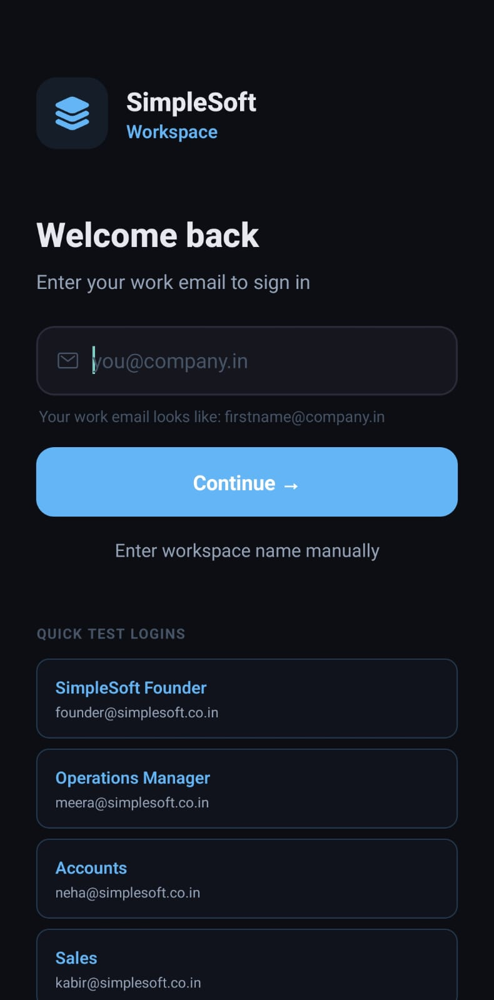
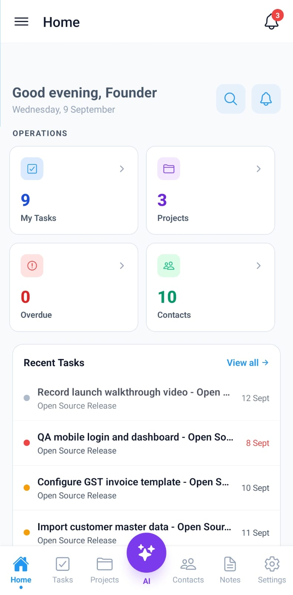
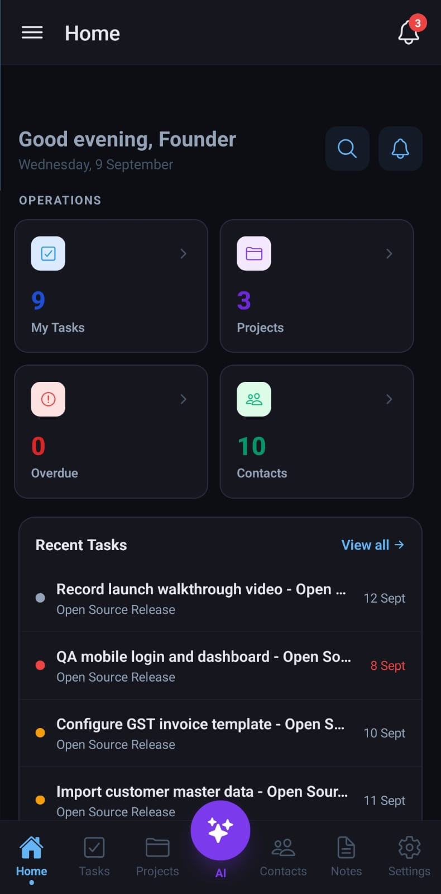
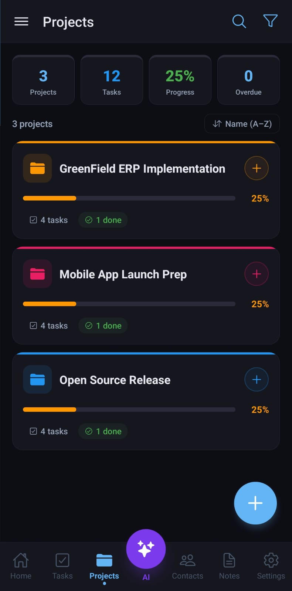
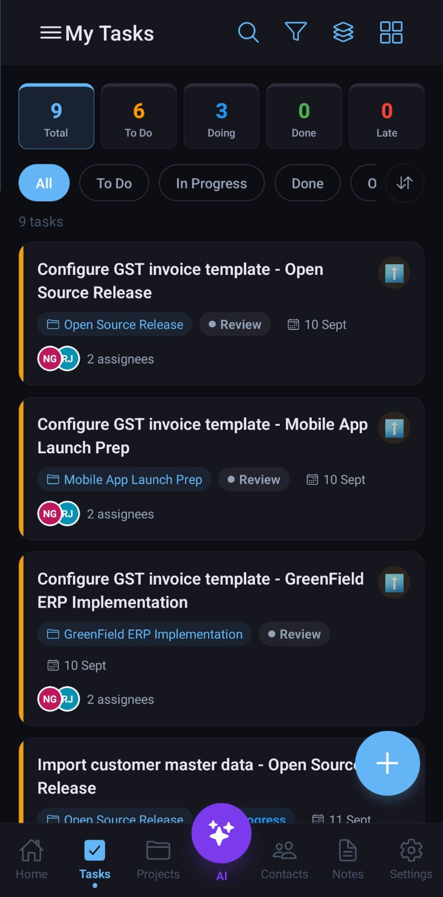
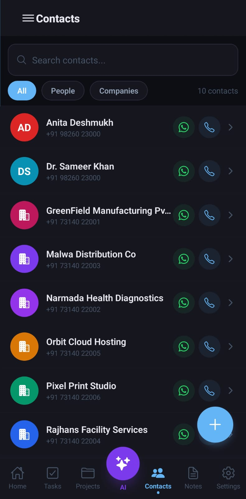
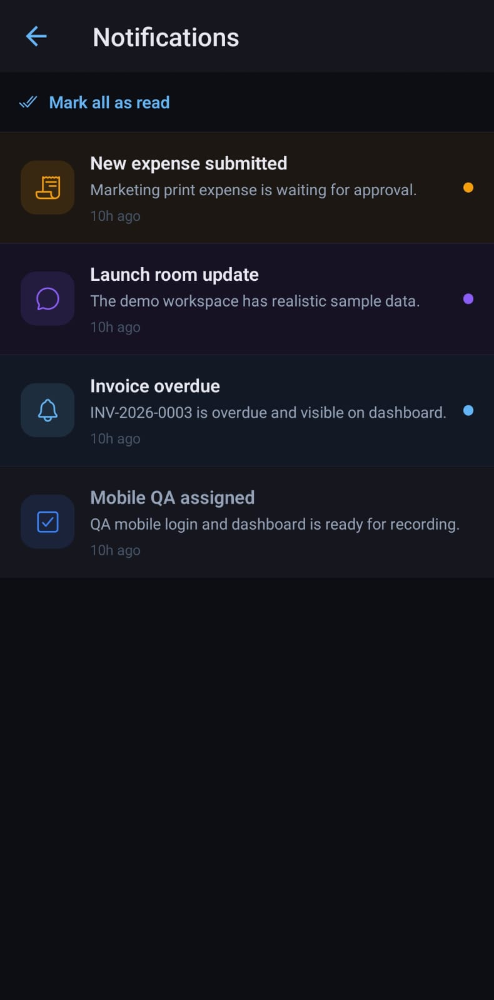
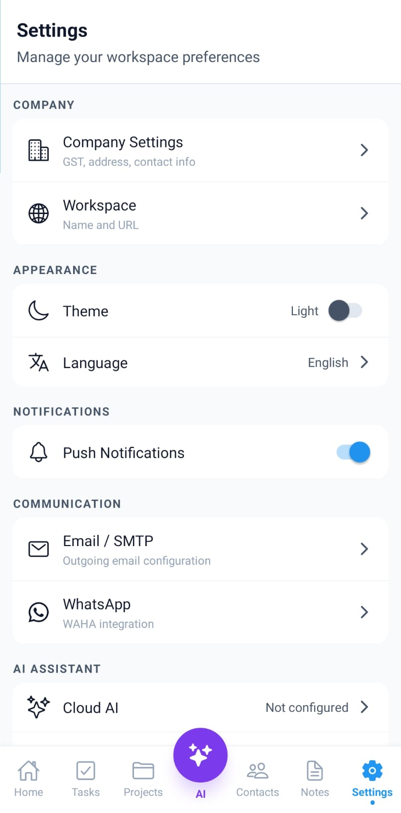
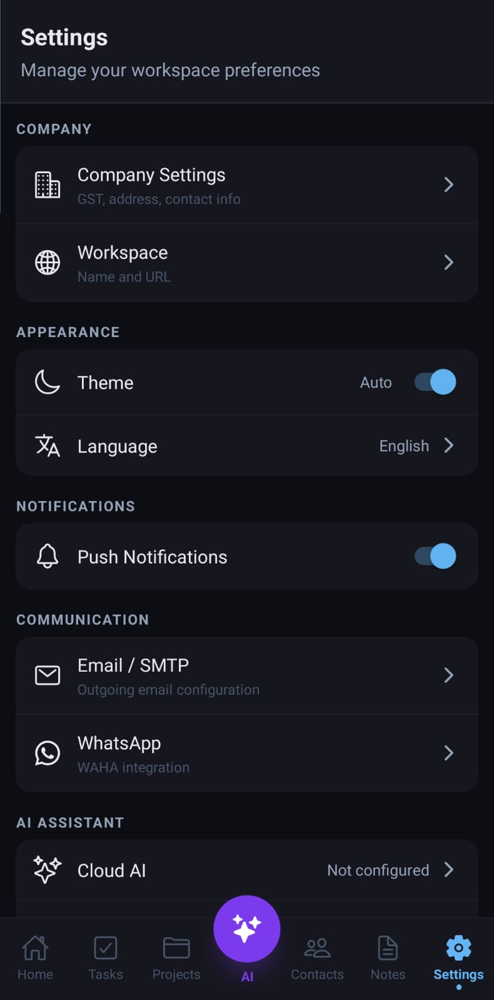
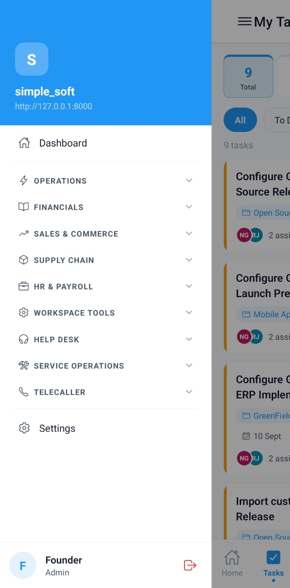
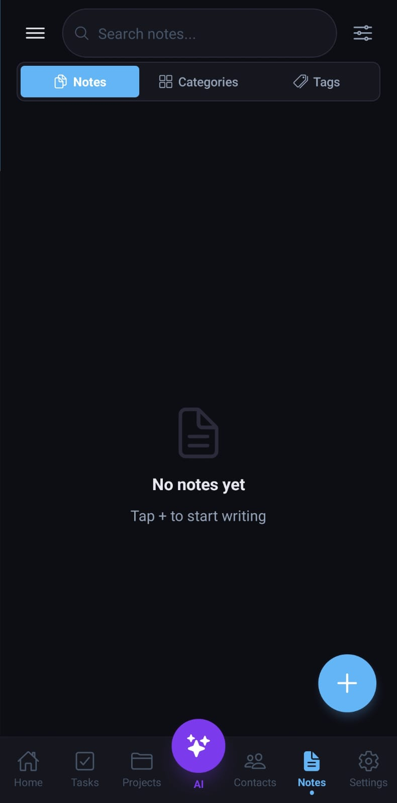
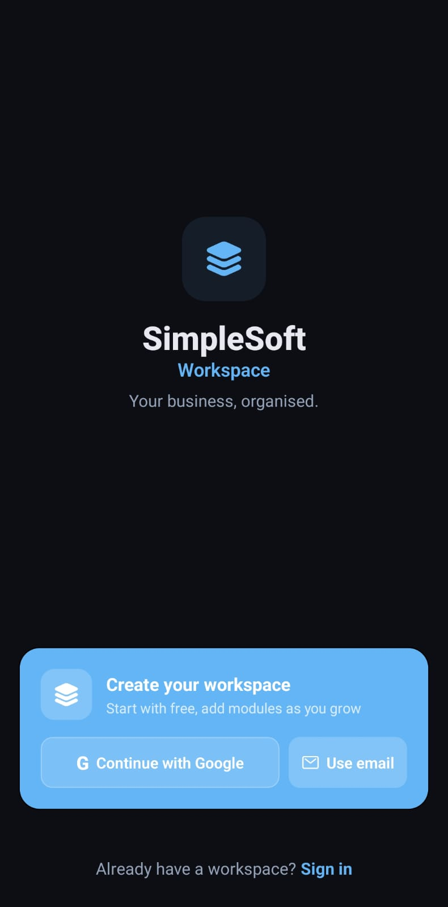
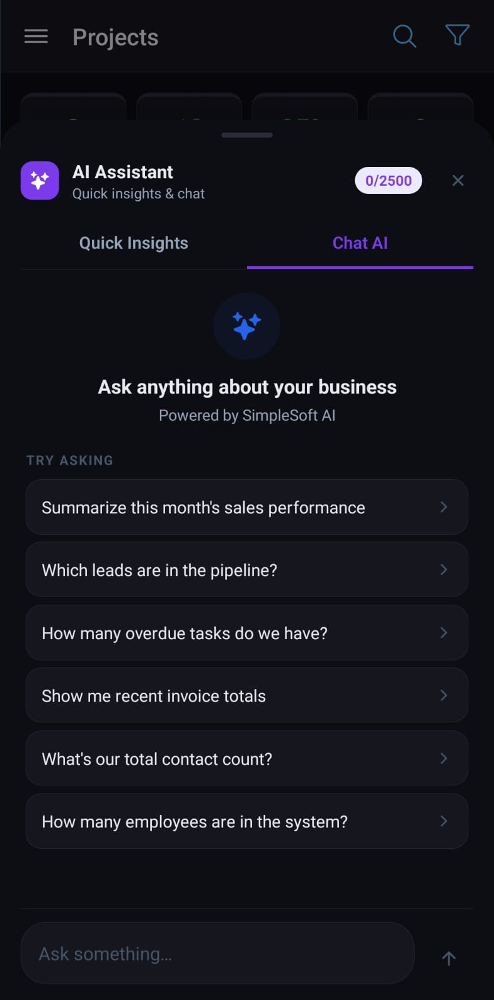
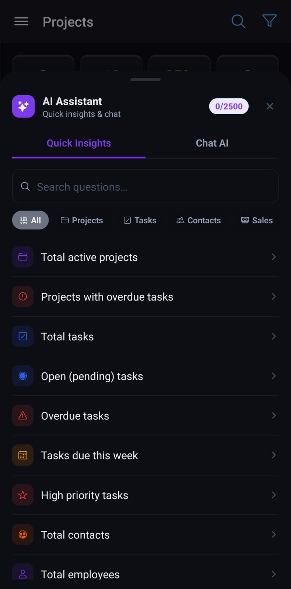

## Features

- Real-time dashboard with key metrics
- CRM and contact management
- Project and task management
- Invoice creation and tracking
- Team chat and notifications
- Dark and light theme support
- Push notifications via Firebase
- AI-powered features
- Responsive design for all phone sizes

## Stack

- React Native
- Expo (development)
- Redux for state management
- Firebase for push notifications
- Integrated with SimpleSoft backend API

## Setup

Clone the repository and install dependencies:

```bash
git clone https://github.com/simple-softwares/simplesoft-mobile.git
cd simplesoft-mobile
npm install
```

### Development

Run on iOS or Android:

```bash
npx expo start
```

### Build APK

```bash
eas build --platform android
```

## Backend Connection

Update the API endpoint in your configuration:

```javascript
const API_URL = "http://your-backend:8000/api";
```

## Contributing

We welcome contributions. Please read the main SimpleSoft docs for contribution guidelines.

## License

MIT

## Get Started

- SimpleSoft Docs: https://github.com/simple-softwares/simplesoft-docs
- Backend: https://github.com/simple-softwares/simplesoft-backend
- Web Frontend: https://github.com/simple-softwares/simplesoft-frontend
